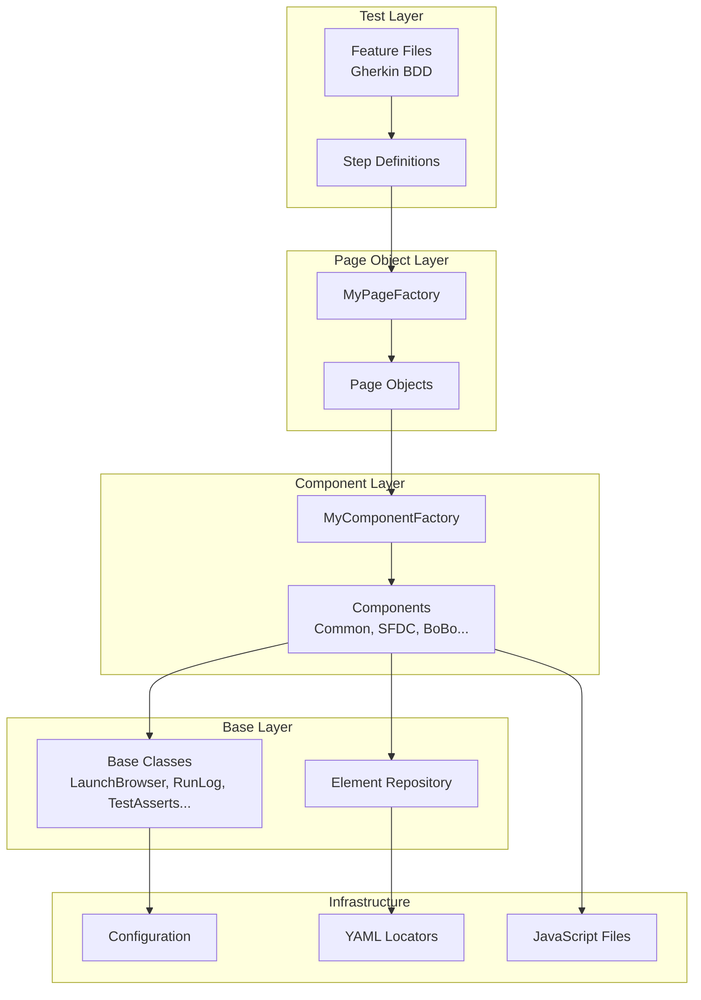

# SFDC Automation Framework Documentation

> **A comprehensive QA automation framework designed for Salesforce (SFDC) and web application testing**  
> Built with: **Java 19** | **Selenium 4.19** | **Cucumber 7.15** | **TestNG 7.9** | **Allure 2.27**

---

## Table of Contents

1. [Framework Overview](#framework-overview)
2. [Architecture & Design Patterns](#architecture--design-patterns)
3. [Project Structure](#project-structure)
4. [Core Components](#core-components)
   - [Base Package](#base-package---core-utilities)
   - [Common Class](#the-common-class---heart-of-the-framework)
   - [Element Repository](#element-repositoryyaml-based-locators)
   - [Factory Pattern](#factory-pattern)
5. [Salesforce-Specific Features](#salesforce-specific-features)
6. [JavaScript-Driven Element Handling](#javascript-driven-element-handling)
7. [Configuration Management](#configuration-management)
8. [Reporting & Logging](#reporting--logging)
9. [Test Execution](#test-execution)
10. [Key Design Decisions](#key-design-decisions)

---

## Framework Overview

The **SFDC Automation Framework** is an enterprise-grade test automation solution built specifically for **Salesforce Lightning** applications. It combines the power of:

| Technology | Purpose |
|------------|---------|
| **Selenium WebDriver 4.19** | Browser automation & Lightning component interaction |
| **Cucumber BDD 7.15** | Behavior-driven test specification |
| **TestNG 7.9** | Test execution & parallel running |
| **Allure 2.27** | Rich, interactive test reporting |
| **REST Assured 5.4** | Salesforce API testing |
| **Log4j 2.23** | Structured logging |

### Key Features

- ✅ **Multi-browser support** – Chrome, Edge with automatic driver management
- ✅ **Headless execution** – Configurable via properties file  
- ✅ **Hybrid UI + API testing** – SOAP & REST API integration for Salesforce
- ✅ **Dynamic element handling** – JavaScript-based element discovery for Lightning components
- ✅ **YAML-based locator repository** – Centralized, maintainable element definitions
- ✅ **Data-driven testing** – JavaFaker integration for dynamic test data
- ✅ **Password encryption** – Jasypt-based secure credential storage
- ✅ **Multi-environment support** – YAML-based environment configuration

---

## Architecture & Design Patterns



### Design Patterns Used

| Pattern | Implementation | Purpose |
|---------|---------------|---------|
| **Page Object Model (POM)** | `Pages/` folder with page classes | Encapsulates page-specific logic |
| **Component Pattern** | `Components/` folder | Reusable UI component interactions |
| **Factory Pattern** | `MyPageFactory`, `MyComponentFactory` | Centralized object instantiation |
| **Fluent Interface** | Wait utilities, API builders | Readable, chainable methods |
| **Singleton** | `Common.driver` (static WebDriver) | Single browser instance |
| **Strategy Pattern** | Browser selection in `LaunchBrowser` | Runtime browser switching |

---

## Project Structure

```
SFDC_AUTOMATION/
├── 📁 Features/                          # Cucumber feature files
│   ├── SalesforceTest.feature
│   ├── BoBo Enrollment.feature
│   └── ...
├── 📁 src/
│   ├── 📁 main/java/base/                # Core utility classes
│   │   ├── Environment.java              # Environment config loader
│   │   ├── JSONLog.java                  # JSON formatting for logs
│   │   ├── LaunchBrowser.java            # WebDriver factory
│   │   ├── PasswordDecrypt.java          # Credential decryption
│   │   ├── PropertiesLoader.java         # Properties file reader
│   │   ├── RunLog.java                   # Logging wrapper
│   │   └── TestAsserts.java              # Custom assertion library
│   │
│   └── 📁 test/
│       ├── 📁 java/Test101/
│       │   ├── TestRunner.java           # Cucumber JUnit runner
│       │   ├── 📁 Components/            # Reusable components
│       │   │   ├── Common.java           # ⭐ Central utility class
│       │   │   ├── Element.java          # YAML locator parser
│       │   │   ├── SearchMe.java         # Search functionality
│       │   │   ├── 📁 SFDC/              # Salesforce components
│       │   │   ├── 📁 BoBo/              # Business-specific components
│       │   │   └── ...
│       │   ├── 📁 Pages/                 # Page Object classes
│       │   │   ├── CommonPage.java
│       │   │   ├── SFDCLoginPage.java
│       │   │   └── ...
│       │   ├── 📁 StepDefs/              # Cucumber step definitions
│       │   │   ├── CommonStepDef.java
│       │   │   ├── SFDCStepDefs.java
│       │   │   └── ...
│       │   ├── 📁 Factory/               # Factory pattern classes
│       │   │   ├── 📁 PageFactory/
│       │   │   └── 📁 ComponentFactory/
│       │   ├── 📁 WebServices/           # API automation
│       │   │   └── 📁 Salesforce/
│       │   └── 📁 utils/                 # Utility classes
│       │       ├── SalesforceClient.java # REST API client
│       │       ├── YamlReader.java
│       │       └── StorageMap.java
│       │
│       └── 📁 resources/
│           ├── 📁 Locators/              # YAML element repositories
│           │   └── SFDCLocators.yaml
│           ├── 📁 jsFiles/               # JavaScript element finders
│           │   ├── createRecord.js
│           │   ├── detailsPage.js
│           │   └── ...
│           └── 📁 TestParams/            # Test data files
│
├── config.properties                      # API credentials
├── environment.yaml                       # Environment configurations
└── pom.xml                               # Maven dependencies
```

---

## Core Components

### Base Package - Core Utilities

The `base` package contains **7 foundational classes** that provide framework-wide functionality:

#### 1. `LaunchBrowser.java` - WebDriver Factory

```java
public LaunchBrowser(String browserName) {
    switch (browserName) {
        case "Chrome" -> driver = setupChromeDriver();
        case "Edge" -> { /* Edge setup */ }
        default -> { /* Fallback to Chrome */ }
    }
}
```

**Features:**
- Automatic driver management via **WebDriverManager**
- Configurable **headless mode** via `config.properties`
- CDP version error suppression for cleaner logs
- Window maximization on launch

#### 2. `Environment.java` - Multi-Environment Configuration

```java
public Environment() {
    String environment = System.getProperty("environment");
    // Loads environment-specific values from environment.yaml
    data = yamlData.get(environment);
}

public String getValue(String key) {
    return (String) data.get(key);
}
```

**Usage:** Pass `-Denvironment=TEST1` at runtime to select environment.

#### 3. `RunLog.java` - Centralized Logging

```java
public static void info(String message) { Log.info(message); }
public static void error(String message, Throwable exp) { Log.error(message, exp); }
public static void specialInfo(String message) { specialInfoLog.info(message); }
```

**Log Levels:** `trace`, `debug`, `info`, `warn`, `error`, `fatal`, plus `specialInfo` for highlighted messages.

#### 4. `TestAsserts.java` - Custom Assertions

| Method | Purpose |
|--------|---------|
| `assertEquals(String, String)` | Case-insensitive string comparison |
| `assertTextContains(String, String)` | Substring validation |
| `assertTextContainsIgnoreCase(...)` | Case-insensitive contains |
| `validateTextNotPresentInList(...)` | List exclusion validation |
| `assertCondition(boolean, boolean, String)` | Conditional true/false assertion |

#### 5. `PropertiesLoader.java` - Configuration Reader

Loads `config.properties` from project root for API credentials and settings.

#### 6. `PasswordDecrypt.java` - Secure Credentials

Uses **Jasypt** for password decryption, ensuring credentials are stored encrypted.

#### 7. `JSONLog.java` - Colorized JSON Output

Provides ANSI-colorized JSON logging for better API response readability in console.

---

### The Common Class - Heart of the Framework

> ⭐ **`Common.java`** is the **centerpiece** of this framework, containing **50+ utility methods** that every component inherits.

```java
public class Common extends Element {
    public static WebDriver driver;
    public WebDriverWait webDriverWait;
    public JavascriptExecutor jse = (JavascriptExecutor) driver;
    public Environment environment = new Environment();
    // ... 500+ lines of utility methods
}
```

#### Method Categories

<details>
<summary><strong>🌐 Browser & Navigation Methods (10)</strong></summary>

| Method | Description |
|--------|-------------|
| `setUp()` | Initializes test, clears logs, logs system info |
| `navigateToApplicationInBrowser(String, String)` | Launches browser and navigates to app |
| `navigateToURLInBrowser(String, String)` | Opens specific URL in browser |
| `navigateToWebsite(String)` | Navigates to website from environment config |
| `navigateToURL(String)` | Direct URL navigation |
| `navigateToSalesforceLoginUrl(String)` | SFDC-specific URL navigation |
| `closeAndQuitBrowser()` | Gracefully closes all browser windows |
| `refreshAndWait()` | Page refresh with wait |
| `waitForPageLoad(WebDriver)` | Waits for `document.readyState = complete` |
| `getDefaultTextFromDropDown(WebDriver, By)` | Gets default dropdown selection |

</details>

<details>
<summary><strong>⏳ Wait & Synchronization Methods (4)</strong></summary>

| Method | Description |
|--------|-------------|
| `wait(int seconds)` | Fluent wait with configurable timeout |
| `waitForElementToBeVisible(By)` | Explicit wait for element visibility |
| `isAreaExpanded(WebElement)` | Checks `aria-expanded` attribute |

**FluentWait Configuration:**
```java
return new FluentWait<>(driver)
    .withTimeout(Duration.ofSeconds(waitForSeconds))
    .pollingEvery(Duration.ofMillis(500))
    .ignoring(NoSuchElementException.class, JavascriptException.class)
    .ignoring(StaleElementReferenceException.class);
```

</details>

<details>
<summary><strong>🖱️ Element Interaction Methods (12)</strong></summary>

| Method | Description |
|--------|-------------|
| `clearAndSendKeys(WebElement, String)` | Clears field and types text |
| `typeAsCharacters(String, WebElement)` | Types text character by character |
| `actionClick(WebElement)` | Click using Actions API |
| `clickElementWithJS(WebElement)` | JavaScript-based click |
| `doubleClickOnElement(WebDriver, WebElement)` | Double-click action |
| `mouseHover(WebElement)` | Hover over element |
| `hoverOnElementAndClick(WebElement)` | Hover then click |
| `scrollToAnElement(WebDriver, WebElement)` | Scroll element into view |
| `scrollToBottomOfThePage()` | Scroll to bottom |
| `scrollToEndOfThePage()` | Scroll to document end |
| `acceptAlert()` | Accept browser alert |
| `switchToFrameUsingFrameName(String)` | Frame switching |

</details>

<details>
<summary><strong>📸 Screenshot & Reporting Methods (6)</strong></summary>

| Method | Description |
|--------|-------------|
| `takeScreenshot(String)` | Saves screenshot to Artifacts folder |
| `captureScreenshot(Scenario)` | Attaches screenshot to Cucumber scenario |
| `attachScreenShotOfThePageToAllureReport(String)` | Attaches screenshot to Allure |
| `attachLogsToAllureReport()` | Attaches test logs to report |
| `addAdditionalInfoToAllureReport(Temporal)` | Adds test duration info |
| `updateErrorDetailsToReport(String, String, String)` | Logs error with method context |

</details>

<details>
<summary><strong>📜 JavaScript Element Map Methods (6)</strong></summary>

| Method | Description |
|--------|-------------|
| `getElementsAsMap(String jsPath)` | Executes JS and returns element map |
| `getElementsAsMap(String, String)` | Waits for specific key in map |
| `getDropDownsElementMap(String, String, String)` | Gets dropdown options by title |
| `getDropDownsElementMapWithGetText(...)` | Gets dropdown options by text |
| `selectOptionFromDropdown(String, String, int)` | Selects by index |
| `selectOptionFromDropdown(String, String, String)` | Selects by value |
| `readFileAsString(String)` | Reads JS file content |

</details>

<details>
<summary><strong>🔧 Test Lifecycle Methods (4)</strong></summary>

| Method | Description |
|--------|-------------|
| `setUp()` | Pre-test initialization |
| `tearDown(Temporal)` | Post-test cleanup (success) |
| `tearDownForTestFailure(Scenario, Temporal)` | Post-test cleanup (failure) |
| `logErrorAndTakeScreenshot(String, String, String)` | Error handling with screenshot |

</details>

---

### Element Repository (YAML-Based Locators)

The `Element.java` class provides a **YAML-based locator repository** for maintainable element definitions:

#### Element.java - The Locator Parser

```java
public static By returnBrowserElementFromRepo(String yamlFileName, 
                                               String componentName, 
                                               String elementName) {
    // Loads from src/test/resources/Locators/{yamlFileName}.yaml
    Map<String, Object> component = locators.get(componentName);
    Map<String, Object> element = component.get(elementName);
    
    return switch (element.get("type")) {
        case "xpath" -> By.xpath(value);
        case "id" -> By.id(value);
        case "css" -> By.cssSelector(value);
        // ... other types
    };
}
```

#### YAML Locator Structure

```yaml
# src/test/resources/Locators/SFDCLocators.yaml
SFDCLoginComponent:
  inputUsername:
    type: "xpath"
    value: "//input[@id='username']"
    required: required
  inputPassword:
    type: "xpath"
    value: "//input[@id='password']"
    required: required
  btnLogin:
    type: "xpath"
    value: "//input[@id='Login']"
    required: required

SFDCLogoutComponent:
  userIcon:
    type: "css"
    value: "div.forceEntityIcon img.noicon"
  logoutLink:
    type: "css"
    value: "a.logout"
```

**Benefits:**
- 📁 **Centralized** – All locators in one place
- 🔧 **Maintainable** – No code changes for locator updates
- 📖 **Readable** – Human-friendly YAML format
- 🏷️ **Organized** – Grouped by component/page

---

### Factory Pattern

The framework uses a **two-tier factory pattern** for clean dependency management:

#### MyComponentFactory.java

```java
public class MyComponentFactory {
    public Common common() { return new Common(); }
    public SFDCLogin sfdcLogin() { return new SFDCLogin(); }
    public CreateAccount createAccount() { return new CreateAccount(); }
    public CreateContact createContact() { return new CreateContact(); }
    public BoBoEnrollmentComponent boBoEnrollment() { return new BoBoEnrollmentComponent(); }
    // ... 15+ component factories
}
```

#### MyPageFactory.java

```java
public class MyPageFactory {
    public CommonPage commonPage() { return new CommonPage(); }
    public SFDCLoginPage sfdcLoginPage() { return new SFDCLoginPage(); }
    public SFDCAccountDetailsPage sfdcAccountDetailsPage() { return new SFDCAccountDetailsPage(); }
    // ... 12+ page factories
}
```

#### Inheritance Chain

```
StepDef → MyPageFactory → Page → MyComponentFactory → Component → Common → Element
```

**Example:**

```java
// In SFDCStepDefs.java
public class SFDCStepDefs extends MyPageFactory {
    @When("User login to SFDC as {string}")
    public void sfdcLogin(String user) {
        sfdcLoginPage().loginToSFDCAsUser(user);  // Uses factory method
    }
}
```

---

## Salesforce-Specific Features

### SOAP API Login (Session-Based)

The framework implements sophisticated Salesforce login using **SOAP API**:

```java
// SFDCLogin.java
public void loginToSalesforce(String user) {
    Thread getSessionIdThread = new Thread(() -> {
        getSessionId(username, password, applicationName);
    });
    getSessionIdThread.start();
    
    String baseUrl = environment.getValue("CRM") + sessionId;
    navigateToSalesforceLoginUrl(baseUrl);
}
```

**Process:**
1. Authenticate via SOAP API endpoint
2. Retrieve session ID
3. Construct front-door URL with session
4. Navigate browser directly to authenticated session

### REST API Client (SalesforceClient.java)

```java
public class SalesforceClient {
    public SalesforceClient() {
        initializeCredentials();
        setAccessToken();  // OAuth2 authentication
    }
    
    public ArrayList<HashMap<String, String>> query(String soqlQuery) {
        return RestAssured.given()
            .auth().oauth2(accessToken)
            .get(resourceUrl + soqlQuery)
            .jsonPath().get("records");
    }
    
    public RequestSpecification request() {
        return RestAssured.given()
            .header("Authorization", "Bearer " + accessToken)
            .header("Content-Type", "application/json");
    }
}
```

### Hybrid Testing Pattern

```java
// SFDCStepDefs.java - API creates data, UI validates
@And("User creates a new account")
public void createNewAccountUsingAPI() {
    String newAccountId = new Salesforce().account().create();  // API call
    sfdcAccountDetailsPage().userNavigateToAccount(newAccountId);  // UI navigation
}
```

### Data Factory Pattern

```java
// DataGenerator.java - Generates randomized test data
public static Map<String, String> generateAccountData() {
    Faker faker = new Faker();
    return Map.of(
        "AccountName", faker.company().name(),
        "AccountNumber", faker.number().digits(8),
        "City", faker.address().city(),
        // ...
    );
}

// AccountDataFactory.java - Queries existing data
public String getIdFor(String accountRequirement) {
    String query = "SELECT Id FROM Account WHERE " + condition;
    return salesforceClient.query(query).get(0).get("Id");
}
```

---

## JavaScript-Driven Element Handling

> **Why JavaScript?** Salesforce Lightning uses **Shadow DOM** and **dynamic rendering**, making traditional Selenium locators unreliable. This framework uses JavaScript to **dynamically discover elements** at runtime.

### How It Works

```java
// In CreateAccount.java
Map<String, WebElement> quickLinks = getElementsAsMap(
    pathForJs + "createRecord.js", 
    "*Account Name"
);
clearAndSendKeys(quickLinks.get("*Account Name"), accountData.get("AccountName"));
clickElementJS(quickLinks.get("Industry"));
```

### JavaScript Element Finder (createRecord.js)

```javascript
let map = new Map();

// Find all record layout items in the modal
let rootNode = xpathSingleEval("//records-modal-lwc-detail-panel-wrapper", document);
let listItem = document.evaluate(".//records-record-layout-item", rootNode, ...);

while (listNode) {
    let label = xpathSingleEval(".//label", listNode);
    let input = xpathSingleEval(".//input", listNode);
    let dropdown = xpathSingleEval(".//lightning-base-combobox//button", listNode);
    
    if (label && input) {
        map.set(label.textContent, input);  // e.g., "Account Name" → <input>
    } else if (dropdown) {
        map.set(label.textContent, dropdown);  // e.g., "Industry" → <button>
    }
    listNode = listItem.iterateNext();
}

return Object.fromEntries(map);
```

### Available JavaScript Files

| File | Purpose |
|------|---------|
| `createRecord.js` | Form fields on record create modal |
| `createRecordDropDown.js` | Dropdown options during creation |
| `detailsPage.js` | Fields on record detail page |
| `detailsPageLookUps.js` | Lookup fields on details |
| `subMenu.js` | Navigation menu items |
| `subMenuOne.js` | Submenu options |
| `quickActionButtons.js` | Quick action buttons |
| `relatedTabs.js` | Related list tabs |

### Benefits of This Approach

- ✅ **Dynamic Discovery** – No hardcoded locators for Lightning components
- ✅ **Self-Documenting** – Map keys are human-readable labels
- ✅ **Resilient** – Works regardless of DOM structure changes
- ✅ **Efficient** – Single JS call returns all elements

---

## Configuration Management

### environment.yaml - Multi-Environment Config

```yaml
TEST1:
  Salesforce: https://playful-bear-tflz0-dev-ed.trailblaze.my.salesforce.com
  sfdc_base_url: https://playful-bear-tflz0-dev-ed.trailblaze.lightning.force.com/
  TrialUser_Username: mail.lucky96@playful-bear-tflz0.com
  TrialUser_Password: JoEJiK+PiJ6ZvZUUD6Lc3cuoVlLQdcDb  # Encrypted
  CRM: https://...my.salesforce.com/secur/frontdoor.jsp?sid=
  SalesforceBaseURL: https://...my.salesforce.com/services/data/v61.0
  
# Add more environments (STAGING, PRODUCTION) as needed
```

**Usage:** Run with `-Denvironment=TEST1`

### config.properties - API Credentials

```properties
client_id=3MVG9pRzvMkjMb6mCpU...
client_secret=BE98E2FFB775DD2260288B7D37ECC7B7...
username=mail.lucky96@playful-bear-tflz0.com
password=fHpTadu5ZZswM6ekj36Ga6NurKCx17gj...  # Encrypted
TestUrl=https://playful-bear-tflz0-dev-ed.trailblaze.my.salesforce.com
resourceUrl=/services/data/v61.0/query/?q=
headlessMode=false
```

---

## Reporting & Logging

### Allure Integration

```java
// Automatic screenshot on failure
public void captureScreenshot(Scenario scenario) {
    byte[] screenshot = ((TakesScreenshot) driver).getScreenshotAs(OutputType.BYTES);
    scenario.attach(screenshot, "image/png", "Screenshot");
}

// Test metadata
Allure.addAttachment("Additional Info", "text/plain", 
    "Test completed on " + formattedDate + " at " + formattedTime);
```

### Log4j Configuration

- **Console output** – Real-time execution logs
- **File output** – `Artifacts/logs/TestLogs.log`
- **Colorized JSON** – API responses with ANSI colors
- **Automatic attachment** – Logs attached to Allure report

### Screenshot Management

```java
private static final String SCREENSHOT_PATH = "Artifacts/screenshots/";

public static void takeScreenshot(String screenshotName) {
    File screenshotFile = ((TakesScreenshot) driver).getScreenshotAs(OutputType.FILE);
    FileHandler.copy(screenshotFile, new File(SCREENSHOT_PATH + screenshotName + ".png"));
}
```

---

## Test Execution

### TestRunner Configuration

```java
@RunWith(Cucumber.class)
@CucumberOptions(
    features = "Features",
    glue = "Test101.StepDefs",
    plugin = {
        "pretty",
        "json:target/cucumber-reports/cucumber.json",
        "io.qameta.allure.cucumber7jvm.AllureCucumber7Jvm"
    }
)
public class TestRunner { }
```

### Maven Execution

```bash
# Run all tests
mvn clean test -Denvironment=TEST1 -Denv=Test

# Run specific tag
mvn clean test -Dcucumber.filter.tags="@SalesforceTest"

# Generate Allure report
mvn allure:serve
```

### Sample Feature File

```gherkin
@SFDCAccountCreation @Salesforce
Scenario Outline: Create a new account in Salesforce
  Given User launch "<Website>" in "<Browser>"
  When User logs in to Salesforce with the credentials of "<User>"
  Then Navigate to new account page
  And User create a new account with below details
    | PhoneNumber | Industry    | Ownership | Type     |
    | 9876512340  | Engineering | Private   | Prospect |
  And Validate the new account record data on "Details" tab
  And Log out from SFDC
  And Close the browser
  
  Examples:
    | Browser | Website    | User      |
    | Edge    | Salesforce | TrialUser |
```

---

## Key Design Decisions

### 1. Static WebDriver Instance

```java
public static WebDriver driver;  // In Common.java
```

**Rationale:** Single browser instance shared across all components ensures consistent state and simpler cleanup.

### 2. Inheritance-Based Component Architecture

```
Component extends Common extends Element
```

**Rationale:** Every component automatically inherits 50+ utility methods without explicit instantiation.

### 3. JavaScript for Salesforce Lightning

**Rationale:** Salesforce Lightning's Shadow DOM and dynamic rendering make traditional Selenium locators unreliable. JavaScript provides direct access to the DOM.

### 4. YAML Over Properties Files for Configuration

**Rationale:** YAML supports nested structures, making it ideal for multi-environment configurations and complex data types.

### 5. Factory Pattern for Loose Coupling

**Rationale:** Step definitions depend on factories, not concrete implementations, enabling easy mocking and component swapping.

### 6. Encrypted Credentials

**Rationale:** Jasypt encryption ensures credentials are never stored in plain text, meeting security compliance requirements.

---

## Future Enhancements

- [ ] **Mobile automation** – Appium integration for Android/iOS testing
- [ ] **Parallel execution** – TestNG parallel suite configuration
- [ ] **Docker support** – Containerized test execution
- [ ] **CI/CD integration** – Jenkins pipeline with Allure reporting

---

## Contributors

- **Satyam Anand** – Framework Architect

---

*Last Updated: January 2026*
